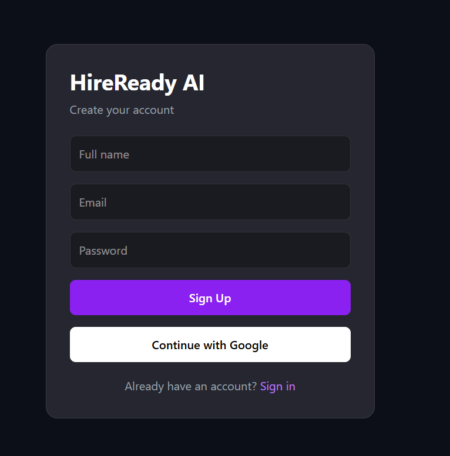
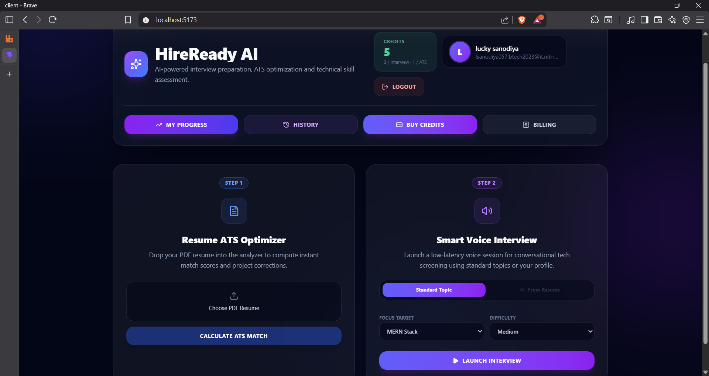
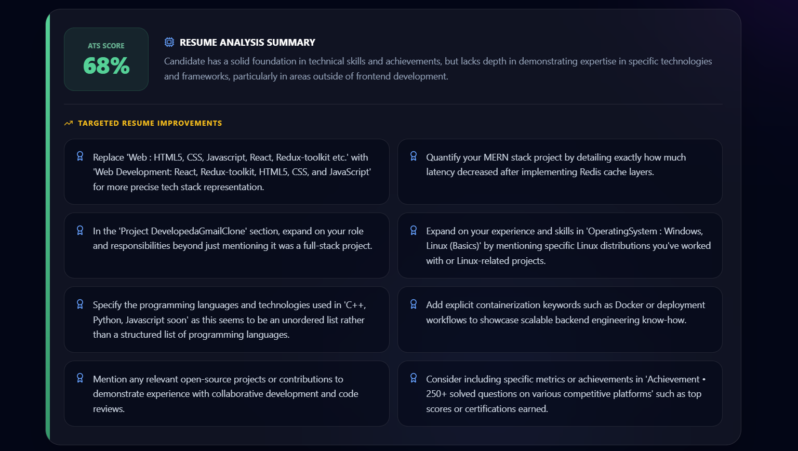
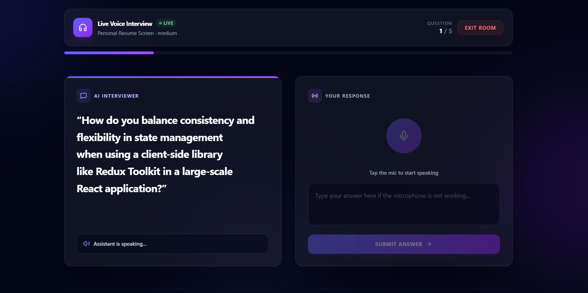
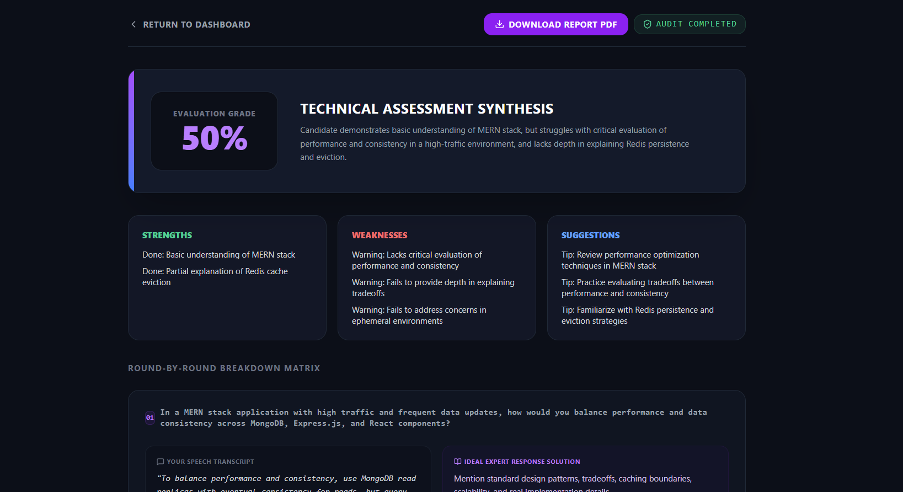
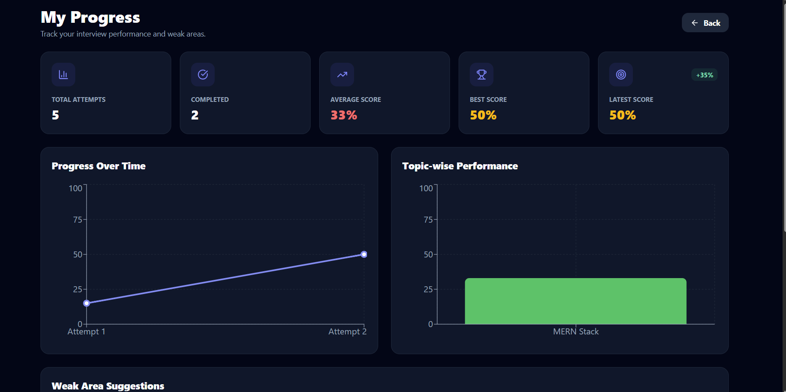
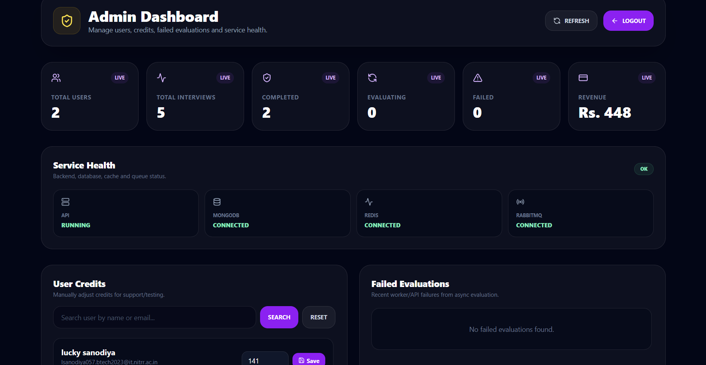
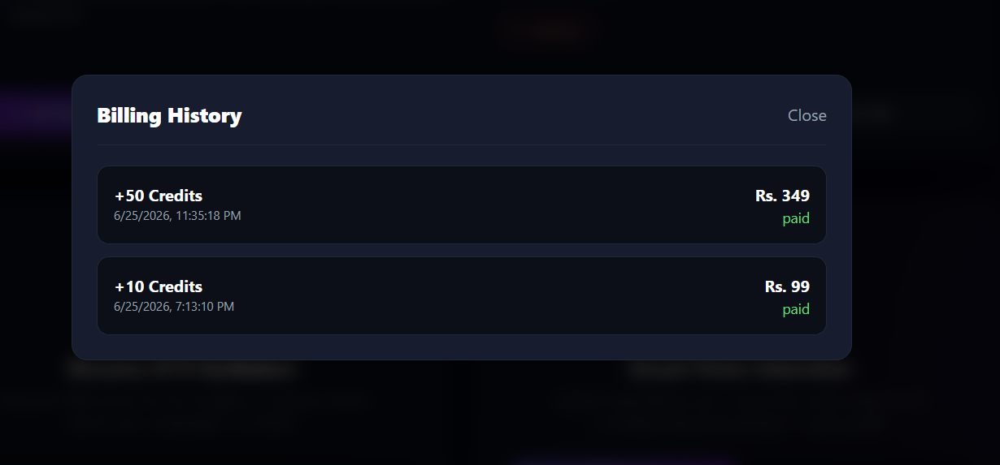

# HireReady AI

HireReady AI is a full-stack AI-powered interview and resume preparation platform built for job seekers. It combines resume ATS analysis, AI voice interview simulation, credit-based usage, payments, interview analytics, and admin/user dashboards in one practical job-preparation product.

> Status: MVP / portfolio-ready foundation. The project demonstrates real full-stack architecture and integrations, but should be hardened further before production use.

# HireReady AI

HireReady AI is a full-stack AI-powered interview and resume preparation platform built for job seekers. It combines resume ATS analysis, AI voice interview simulation, credit-based usage, payments, interview analytics, and admin/user dashboards in one practical job-preparation product.

> Status: MVP / Portfolio-ready Full-Stack AI SaaS Platform

---

## 🌐 Live Demo

🚧 Coming Soon

---

## 🛠️ Built With

- React + Vite
- Tailwind CSS
- Zustand
- Node.js
- Express.js
- MongoDB + Mongoose
- Firebase Authentication
- Groq AI
- Redis
- RabbitMQ
- Razorpay
- Docker

---

## Problem Statement

Job seekers often struggle to understand why their resumes are not shortlisted and how well they can perform in technical interviews. HireReady AI helps users practice with AI-driven interview sessions, analyze resumes for ATS compatibility, track progress, and manage usage through credits.

## 🚀 Resume Highlights

* Full-Stack AI SaaS Platform
* React + Node.js + MongoDB Architecture
* Firebase Authentication (Email/Password + Google Login)
* AI Resume ATS Analysis using Groq LLM
* AI Interview Evaluation System
* Redis Caching Layer with Fallback Support
* RabbitMQ Queue-Based Processing
* Direct Evaluation Fallback Mechanism
* Razorpay Payment Integration
* Credit-Based Usage System
* Analytics Dashboard & Progress Tracking
* Admin Dashboard & Role-Based Access Control


## Key Features

| Feature | Description |
| --- | --- |
| Firebase Auth | Email/password and Google authentication using Firebase. |
| ATS Resume Analyzer | Upload a resume PDF and receive an AI-generated ATS score, summary, and improvement suggestions using Groq API. |
| AI Voice Interview | Simulated voice interview flow with generated questions, speech input support, and final AI evaluation. |
| Credit System | Credit-based access model for ATS scans and interview sessions. |
| Razorpay Payments | Credit purchase flow using Razorpay order creation and signature verification. |
| Payment History | Users can view completed credit purchase history. |
| Redis Cache With Fallback | Resume analysis caching and rate limiting use Redis, while core app behavior can continue if Redis is unavailable. |
| RabbitMQ Async Evaluation With Direct Fallback | Interview evaluation is designed around asynchronous background processing, with fallback behavior for resilient evaluation handling. |
| Analytics Dashboard | Users can view interview history, scores, progress, weak areas, and topic-wise performance. |
| Admin/User Routing | Role-based admin and user dashboard routing with admin tools for users, credits, health, and failed evaluations. |

## Tech Stack

| Layer | Technology |
| --- | --- |
| Frontend | React, Vite, Tailwind CSS, Zustand |
| Authentication | Firebase Auth, Firebase Admin SDK |
| Backend | Node.js, Express.js |
| Database | MongoDB, Mongoose |
| AI | Groq API |
| Payments | Razorpay |
| Cache / Rate Limit | Redis |
| Queue / Worker | RabbitMQ, background evaluation worker |
| Charts / UI | Recharts, Lucide React |

## Architecture Overview

```text
                ┌─────────────────────┐
                │     React Client    │
                └──────────┬──────────┘
                           │
                           ▼
                ┌─────────────────────┐
                │   Express Backend   │
                └──────────┬──────────┘
                           │
        ┌──────────────────┼──────────────────┐
        ▼                  ▼                  ▼
   MongoDB             Redis Cache         Groq API
                           │
                           ▼
                      RabbitMQ
                           │
                           ▼
                 Evaluation Worker

Fallback Flow:

RabbitMQ Unavailable
        │
        ▼
Direct Evaluation Service
        │
        ▼
Evaluation Report Generated
```


## Backend Architecture

The backend follows a modular Express structure:

- `routes/` defines API endpoints by domain.
- `controllers/` contains request handling and business workflows.
- `models/` contains Mongoose schemas.
- `middleware/` contains validation, rate limiting, error handling, and admin access logic.
- `config/` contains Firebase Admin, Redis, and RabbitMQ setup.
- `workers/` contains background interview evaluation logic.

Main backend domains:

| Domain | Responsibility |
| --- | --- |
| Auth | Firebase login sync, protected user session, role handling |
| Resume | PDF parsing, ATS analysis, Redis caching, credit usage |
| Interview | AI question generation, answer submission, history, analytics |
| Payments | Razorpay order creation, signature verification, credit updates |
| Admin | Overview, user management, failed evaluation retry, system health |
| Health | MongoDB, Redis, RabbitMQ, and API status checks |

## Redis Caching Strategy

Redis is used for:

- ATS resume analysis caching by user and resume hash.
- API rate limiting for expensive AI-backed endpoints.
- Reducing duplicate Groq API calls for repeated resume scans.

Example strategy:

```text
Resume PDF -> Extract text -> Hash text -> Check Redis
  |
  |-- Cache hit -> return saved ATS result, no credit deduction
  |
  |-- Cache miss -> call Groq, deduct credit, save result to Redis
```

## RabbitMQ Evaluation Pipeline

### Primary Flow

```text
User submits final answer
        |
        v
Publish Job to RabbitMQ
        |
        v
Evaluation Worker
        |
        v
Groq Evaluation
        |
        v
Store Report in MongoDB
```

### Fallback Flow

```text
RabbitMQ Unavailable
        |
        v
Direct Evaluation Service
        |
        v
Generate Report Immediately
```

This ensures interview evaluation remains available even if the queue service is down.

## Razorpay Payment Flow

```text
User selects credit plan
  |
  v
Backend creates Razorpay order
  |
  v
Frontend opens Razorpay checkout
  |
  v
Razorpay returns payment response
  |
  v
Backend verifies signature
  |
  v
Credits are added and payment is marked paid
```

Payment verification uses Razorpay signature validation before adding credits.

## Admin/User Access Flow

```text
Firebase Login
  |
  v
Backend verifies token
  |
  v
User record loaded from MongoDB
  |
  |-- role = user  -> User Dashboard
  |
  |-- role = admin -> Admin Dashboard
```

Admin access is controlled through configured admin email addresses.

## Local Setup Instructions

### 1. Clone the repository

```bash
git clone https://github.com/jlucky03/HireReady.io.git
cd HireReady.io
```

### 2. Install dependencies

```bash
cd server
npm install

cd ../client
npm install
```

### 3. Configure environment variables

Create environment files for the client and server. Use placeholders only in committed files and keep real secrets local.

### 4. Start local services

Start Redis and RabbitMQ using Docker. MongoDB can be run either locally or through Docker.

```bash
docker compose -f docker-compose.yml up -d
docker compose -f docker-compose.services.yml up -d
```

### 5. Start backend

```bash
cd server
npm run dev
```

### 6. Start evaluation worker

```bash
cd server
npm run worker
```

### 7. Start frontend

```bash
cd client
npm run dev
```

Frontend usually runs on:

```text
http://localhost:5173
```

Backend usually runs on:

```text
http://localhost:5000
```

## Environment Variables

Use these placeholders locally. Do not commit real secrets.

```env
GROQ_API_KEY=
MONGO_URI=
FIREBASE_PROJECT_ID=
FIREBASE_CLIENT_EMAIL=
FIREBASE_PRIVATE_KEY=
RAZORPAY_KEY_ID=
RAZORPAY_KEY_SECRET=
REDIS_URL=
RABBITMQ_URL=
ADMIN_EMAILS=
CLIENT_URL=
```

Suggested frontend variables:

```env
VITE_API_URL=
VITE_FIREBASE_API_KEY=
VITE_FIREBASE_AUTH_DOMAIN=
VITE_FIREBASE_PROJECT_ID=
VITE_FIREBASE_APP_ID=
```

## Folder Structure

```text
HireReady AI
├── client
│   ├── public
│   ├── src
│   │   ├── config
│   │   ├── hooks
│   │   ├── store
│   │   ├── App.jsx
│   │   ├── DashboardHome.jsx
│   │   ├── InterviewRoom.jsx
│   │   ├── EvaluationReport.jsx
│   │   ├── ProgressAnalytics.jsx
│   │   ├── AdminDashboard.jsx
│   │   ├── BuyCredits.jsx
│   │   └── PaymentHistory.jsx
│   ├── package.json
│   └── vite.config.js
│
├── server
│   ├── src
│   │   ├── config
│   │   ├── controllers
│   │   ├── middleware
│   │   ├── models
│   │   ├── routes
│   │   ├── validators
│   │   ├── workers
│   │   └── server.js
│   └── package.json
│
├── docker-compose.yml
├── docker-compose.services.yml
└── README.md
```

## Scripts / Commands

### Frontend

| Command | Description |
| --- | --- |
| `npm run dev` | Start Vite development server |
| `npm run build` | Build frontend for production |
| `npm run lint` | Run ESLint |
| `npm run preview` | Preview production build |

### Backend

| Command | Description |
| --- | --- |
| `npm run dev` | Start Express server with Nodemon |
| `npm start` | Start Express server |
| `npm run worker` | Start RabbitMQ evaluation worker |

# 📸 Application Screenshots

## 🔐 Authentication



---

## 🏠 User Dashboard



---

## 📄 ATS Resume Analyzer



---

## 🎤 AI Voice Interview



---

## 📊 Evaluation Report



---

## 📈 Progress Analytics



---

## 👨‍💼 Admin Dashboard



---

## 💳 Payment History



## Future Improvements

- Add automated backend and frontend tests.
- Add Razorpay webhook handling for stronger payment reconciliation.
- Add stronger production security headers and request sanitization.
- Move Firebase Admin credentials fully to environment-based configuration.
- Add cloud deployment setup for frontend, backend, worker, Redis, RabbitMQ, and MongoDB.
- Add downloadable ATS and interview reports.
- Add more detailed resume history and comparison.
- Add code splitting to reduce frontend bundle size.
- Improve mobile responsiveness and accessibility.
- Add observability with structured logs and metrics.

# 📄 License

This project is intended for educational, portfolio, and demonstration purposes.

## Author

Built By -
Lucky Sanodiya
B.Tech IT, NIT Raipur

Interests:

Full-Stack Development
Backend Engineering
Distributed Systems
AI Applications
Cloud & DevOps

If this project helped you understand AI product architecture, authentication, payments, queues, or caching, consider starring the repository.
